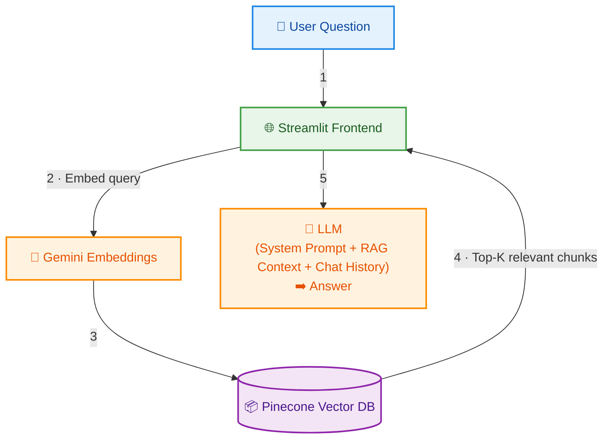

# 🤖 RAG — Computer Vision II

A Retrieval-Augmented Generation (RAG) chatbot that lets **Computer Vision II** students ask questions about the course material and get accurate, source-cited answers. The app can be accessed using [this URL](https://rag-computer-vision-ii.streamlit.app/).

Built with a Streamlit frontend, Pinecone vector database, Gemini embeddings, and multi-provider LLM support.


---

## ✨ Features

- **Multi-provider chat** — Choose between Gemini, OpenAI, Anthropic, or Groq (free Llama 3.3 70B by default).
- **PDF & LaTeX ingestion** — Automatically chunks and embeds course documents (`.pdf` and `.tex` files).
- **Source citations** — Every answer references the exact document and page/section it came from.
- **Smart retrieval** — Uses Gemini embeddings + Pinecone cosine similarity to find the most relevant chunks.
- **Incremental indexing** — Tracks file hashes so unchanged documents are never re-processed.
- **Conversation memory** — Chat history is sent to the LLM for multi-turn conversations.

---

## 🏗️ Architecture



---

## 📁 Project Structure

```
├── data/
│   ├── documents/          # Course documents (.pdf, .tex)
│   └── indexed_registry.json
├── src/
│   ├── chatbot/
│   │   ├── clients.py      # LLM provider implementations
│   │   └── generate.py     # RAG flow: embed → retrieve → generate
│   ├── embed_documents/
│   │   ├── base_processor.py   # Abstract processor with embedding logic
│   │   ├── pdf_processor.py    # PDF chunking (by page)
│   │   ├── tex_processor.py    # LaTeX chunking (by paragraph/section)
│   │   └── main.py             # CLI to index all documents
│   ├── config.py           # Centralized configuration
│   ├── frontend.py         # Streamlit UI
│   └── utils.py            # Hashing, registry, DB/embedding clients
├── tests/
├── ...
```

---

## 🚀 Getting Started (to use it custom/locally)

### 1. Configuration

Create a `.env` file in the project root:

```env
# Required
GEMINI_API_KEY=<your-gemini-api-key>
GROQ_API_KEY=<your-groq-api-key>

PINECONE_API_KEY=<your-pinecone-api-key>
PINECONE_INDEX_NAME=<your-pinecone-index-name>
PINECONE_CLOUD=<your-pinecone-cloud>
PINECONE_REGION=<your-pinecone-region>

# Optional — LangSmith observability
LANGSMITH_API_KEY=<your-langsmith-api-key>
LANGSMITH_TRACING=true
LANGSMITH_PROJECT=RAG-computer-vision-ii
```

> **Note:** LangSmith variables are optional. If set, all LLM calls and tool invocations are automatically traced at [smith.langchain.com](https://smith.langchain.com) — no code changes needed.

### 2. Index Documents

Place your `.pdf` or `.tex` files in `data/documents/`, then run:

```bash
uv run python -m src.embed_documents.main
```

### 3. Launch the Chatbot

```bash
uv run streamlit run src/frontend.py
```
